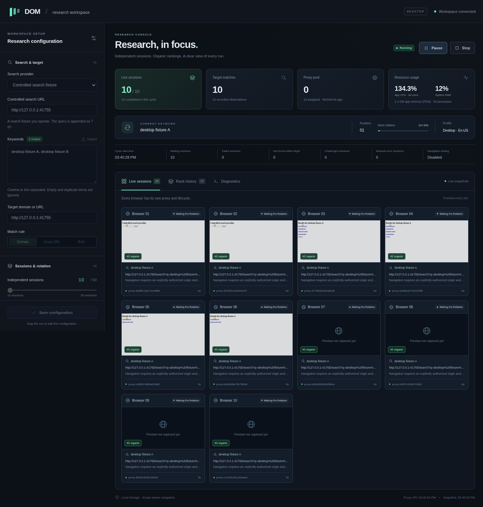

# DOM

DOM is an Electron desktop application for independent Chromium SERP research sessions, DOM inspection, ranking observations, and continuous navigation tests on authorized websites. One controller rotates a shared keyword across 10–50 logical browser contexts. A background worker fetches proxies, checks search-provider reachability through Chromium, and supplies sessions exclusively from its ready pool.



## Install

Windows 10/11 x64 and Ubuntu 22.04/24.04 x64 are the intended platforms. Installers include the browser runtime; Node.js is only needed for development. Published packages appear on the repository's [Releases page](https://github.com/0xSkyler/DOM/releases) after the release workflow's platform tests pass.

- **Windows:** run `DOM-Setup-v1.1.1-Windows-x64.exe`. An unsigned build may trigger SmartScreen; no signing certificate is configured.
- **Ubuntu DEB:** `sudo apt install ./DOM-v1.1.1-Linux-amd64.deb`.
- **Ubuntu AppImage:** `chmod +x DOM-v1.1.1-Linux-x86_64.AppImage`, then run it. Install `libfuse2` on Ubuntu 22.04 or `libfuse2t64` on Ubuntu 24.04 if needed. Alternatively extract with `--appimage-extract` and run `squashfs-root/AppRun`.

Package availability and executed validation are recorded in [docs/validation.md](docs/validation.md). A workflow definition alone is not a verified release.

## Use

1. Enter comma-separated or newline-separated keywords, or import TXT/CSV. Quoted CSV phrases may contain commas; exact duplicates are removed and original order is retained.
2. Enter a target domain or absolute URL. **Domain** includes its subdomains with a dot boundary; **Exact URL** compares protocol, hostname, port, path and query after URL normalization (fragments ignored). **Both** accepts either condition.
3. Choose **10–50 sessions**, a central rotation interval (default **120 seconds**), and search depth. Settings are saved on this machine using **Save configuration** or **Start research**.
4. Set the proxy API URL. The default is `http://169.58.35.69/api/v1/proxies?sort=latency&format=url`. This is unencrypted HTTP; configure an HTTPS endpoint if your provider supports it. Save configuration to start the background worker before research. It fetches a fresh provider response every 60 seconds and checks up to three candidates at once.
5. Choose **Google organic results** for browser research or **Controlled SERP fixture** for an authorized test provider. Press **Start research**.
6. Inspect a browser tile for a screenshot, current URL, pointer, state, keyword, proxy identifier, rank, retries, and last error. Preview collection is deliberately infrequent.
7. Use **Rank history** to inspect positions and export CSV/XLSX. The dashboard shows the latest 1,000 rankings; exports include the complete retained ranking history. Organic rank and SERP element position are separate.

Google research does not automatically click discovered articles. Enable authorized navigation, configure exact origins and path prefixes, then explicitly open a current result from Rank history. Keep Alive scrolls down and up, follows eligible internal article links, and repeats until the central cycle ends or the navigation depth is reached. Controlled SERP mode can perform the result-to-article click automatically within the same explicit scope.

**Pause** cancels research operations, closes their contexts and releases reservations. **Resume** takes checked proxies from the background pool for the same keyword and remaining cycle time. **Stop** closes research browser resources; background checks continue while the app stays open. Closing the app stops the checker too. If the ready pool is empty, research waits and starts automatically when checks succeed. With too few ready proxies, remaining session tiles wait and fill during the current cycle without resetting its deadline. **Retry proxies** requests an early API refresh. Challenged research session IDs remain suspended throughout the run; an explicit new Start resets that suspension.

The **Google-ready proxies** strip reports fetched, pending, deferred, ready, checking, assigned, failed, challenged and expired counts. Fetching and Google reachability are separate: a list can contain many addresses without any currently passing the check. Checks open Google's homepage using the candidate proxy and require a visible search input, a successful response and no challenge; controlled-fixture mode checks the configured test provider instead. Navigation has a 12-second timeout, input visibility at most three seconds, and the full check a 15-second deadline. No search is submitted during a check. Passing shows homepage reachability at that moment, not guaranteed future search access.

Ready checks expire after two minutes. Assigned proxies are never checked or handed to another session concurrently. A healthy released reservation can return to the pool while its check is fresh; failed or challenged reservations must pass a new check before reuse. The background candidate list is bounded to 500 entries. Later provider candidates replace failures at refresh; untouched candidates are checked before failed entries retry, and healthy assignments stay reserved. Credentials and the ready list live only in memory; restarting the app rebuilds the pool.

Provider responses can contain HTTP, HTTPS, SOCKS4 and SOCKS5 URLs, plain `host:port` lines (treated as HTTP), or JSON arrays under `proxies`/`data`. JSON rows support `url`/`proxy`/`server` or `ip`/`host` + `port` + `protocol`/`protocols`/`scheme`, with optional HTTP credentials. Unsupported SOCKS authentication is rejected. Provider redirects retain the API timeout and response size limit. For example, this ProxyScrape text endpoint can be pasted into **Proxy API endpoint**: `https://api.proxyscrape.com/v4/free-proxy-list/get?request=display_proxies&proxy_format=protocolipport&format=text`.

When system RAM reaches **Device & resources → Memory safety limit**, the strip shows **Paused for memory**, the measured percentage and deferred count. API fetching continues; checks resume automatically when memory drops below the limit. Stop research to edit and save that limit, or free memory in other applications. Logical sessions waiting for their first checked proxy are included in **Waiting sessions**; **Live sessions** counts browser proxy reservations.

This v1.1 design intentionally replaces v1.0's no-prevalidation and discard-the-entire-pool-at-each-rotation behavior. Browser contexts and their storage are still disposable at rotation, while the checked background pool survives across keyword cycles.

## Development

Use Node.js 24 and npm in the existing checkout. Each cloud task is already isolated; a separate Git worktree is unnecessary.

```sh
npm ci
npm run prepare:browser
npm run dev
```

`prepare:browser` installs the Playwright-pinned runtime and copies it into `.cache/portable-chromium` for desktop builds. `DOM_CHROMIUM_PATH` overrides the development runtime. On Ubuntu, install the Chromium/Electron system libraries using the distribution's package manager; CI runners already provide them. The cloud container's tested reusable setup is in [docs/cloud-setup.md](docs/cloud-setup.md).

```sh
npm run typecheck
npm test
npm run test:browser
npm run test:integration
npm run build
npm run test:desktop
```

Linux desktop validation needs a display. Use `xvfb-run -a npm run test:desktop` on a server with Xvfb. On this restricted cloud container, the OS sandbox helper cannot be used; the explicitly isolated QA environment uses `DOM_DISABLE_CHROMIUM_SANDBOX=1`. Normal desktop launches leave Chromium's OS sandbox enabled. Do not use that QA option on arbitrary browsing machines.

## Build and release

```sh
npm run prepare:browser
npm run package:linux    # native Linux: AppImage + DEB
npm run package:win      # native Windows: NSIS EXE
node scripts/package-smoke.mjs
node scripts/checksums.mjs
```

Build on each native platform. CI validates Ubuntu 22.04, Ubuntu 24.04 and Windows Server 2022. Release CI builds Windows and Ubuntu packages, extracts/installs them, and exercises the packaged application with ten proxied fixture sessions before publishing. It requires no user-supplied release token: GitHub Actions uses the repository-scoped `GITHUB_TOKEN` with contents-write permission.

Push a tag matching `package.json`, e.g. `v1.1.0`, to run `.github/workflows/release.yml`. Both platform jobs must succeed before publication. A Windows Server smoke is evidence for the Windows build; interactive Windows 10/11 testing remains a separate compatibility check. Extended unattended soak testing is also separate from the short controlled lifecycle suite.

## Architecture, storage and limits

- [Architecture and lifecycle](docs/architecture.md)
- [Executed validation and measurements](docs/validation.md)
- [Cloud environment setup](docs/cloud-setup.md)

Settings, cycles, allocations, observations, diagnostics and navigation measurements use native SQLite (`node:sqlite`) in Electron's user-data directory: `%APPDATA%/DOM` on Windows and `~/.config/DOM` on Linux (actual product folder may follow the package name). WAL and full synchronous commits retain completed rankings before contexts are disposed. Diagnostics retain 5,000 entries, navigation/allocation logs 20,000, and session metadata the latest session state. Rankings and observations persist without that truncation. `DOM_DATA_DIR` overrides the directory for controlled QA.

Proxy credentials exist in the background pool's memory and never enter allocation history or logs. API URLs containing key/token query parameters require a supported OS credential store before saving; Linux's plaintext safeStorage fallback is rejected for those settings. Google reachability checks are implemented; CAPTCHA solving, challenge evasion and external IP/latency benchmarking are not.

Live Google layouts, consent pages, availability and access restrictions change. Unknown layouts produce inconclusive observations; connection failures do not mean rank zero. Search location is user-specified observation metadata, not an independently verified geolocation. Service workers are disabled in disposable research contexts; sites depending on them may need a separate test configuration. Safe internal-link filtering is conservative and excludes actions, downloads, external origins and URLs beyond your path scope. Resource measurements are observations of the tested machine, not a performance guarantee for 50 sessions on every device.
